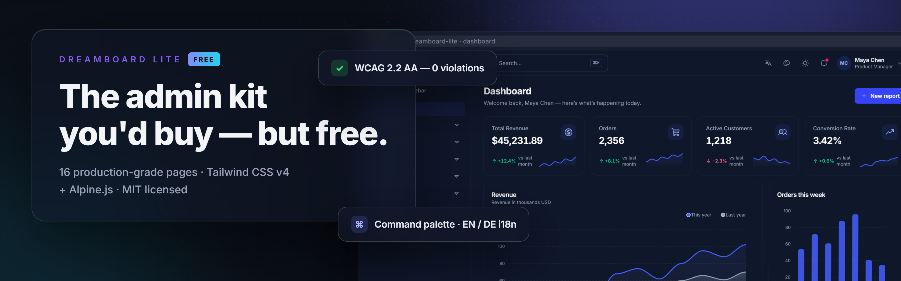

<div align="center">

<picture>
  <source media="(prefers-color-scheme: dark)" srcset="https://motiondreamatix.de/assets/logos/mdx/svg/wortmarke-white.svg">
  
</picture>

<p></p>

<h1>DreamBoard Lite</h1>

<p>
  
  
  
  
  
</p>

<p>
  <strong>The free edition of DreamBoard</strong> — a production-grade
  admin dashboard UI kit. Lite ships 16 hand-picked pages from
  the full 56-page kit so you can evaluate the real codebase —
  or ship a small admin for free, forever.
</p>

<p>
  <a href="https://v1.dreamboard.motiondreamatix.de/html/">Live demo</a> ·
  <a href="https://motiondreamatix.gumroad.com/l/dreamboard">Full kit on Gumroad</a> ·
  <a href="https://motiondreamatix.de/portfolio/18/dreamboard-multi-stack-ui-kit">Portfolio</a> ·
  <a href="https://motiondreamatix.de/blog/gumroad-shop-eroeffnung-dreamboard">Blog: the story behind it</a>
</p>

<a href="https://v1.dreamboard.motiondreamatix.de/html/">
  
</a>

</div>

## What's inside

- **16 pages**: dashboard, orders table + order detail, reports,
  report builder, charts, form layouts, notifications, billing,
  pricing, sign-in/up/forgot/sign-out, 404 + 500
- **The full component layer** those pages use: stat cards, sortable +
  paginated tables, bulk actions, dropdowns, modals, toasts, badges,
  avatars, skeletons — every partial documents its contract in a
  leading comment
- **Design tokens** in `packages/tailwind-config/theme.css` —
  5 accent presets, dark mode, `tokens.json` (W3C DTCG) for Tokens
  Studio / Style Dictionary
- **i18n**: English + German dictionaries, every UI string via `$t()`
- **The data contract**: `data/mockData.js` is the single swap point —
  `mockData.d.ts` (IntelliSense) + `mockData.schema.json` (JSON Schema)
  are generated from it
- **A real quality gate**: `npm run audit` runs axe-core (WCAG 2.2 AA,
  light + dark) plus interaction and performance-budget checks

## Quick start

```bash
npm install
npm run dev      # dev server with rebuild on change
npm run build    # → apps/01-html/dist/ (open dist/index.html)
npm run audit    # WCAG 2.2 AA + static scans, light + dark
```

Requires Node.js 20+. No framework, no bundler — the build is a
dependency-light templating step + the Tailwind CLI.

## Lite vs. the full kit

|                         | Lite            | Full kit                          |
|-------------------------|-----------------|-----------------------------------|
| Pages                   | 16       | 56                     |
| HTML + Alpine edition   | ✓               | ✓                                 |
| React (JSX) edition     | —               | ✓ DOM-parity verified             |
| Fullstack editions      | —               | ✓ FastAPI + PostgreSQL, JWT auth  |
| AI suite, realtime,     | —               | ✓                                 |
| landing pages, explorer |                 |                                   |
| Docs site + buyer docs  | README + AGENTS | full VitePress site               |
| Upgrade-diff tooling    | —               | ✓ 3-way merge into your edits     |
| License                 | MIT             | Commercial                        |
|                         | **[Get the full kit](https://motiondreamatix.gumroad.com/l/dreamboard)** |                     |

## Architecture

```
apps/01-html/
  src/pages/*.html        pages — compiled to dist/ root
  src/components/*.html   partials — inlined via {{> components/name}}
  src/layouts/*.html      base (app shell) / blank (auth & utility)
  src/css/main.css        Tailwind v4 entry + component classes
  src/js/app.js           Alpine stores, magics ($t, $icon, fmt)
  data/mockData.js        ALL dynamic content (window.mockData)
  data/i18n.js            UI dictionary, en + de
packages/tailwind-config/ design tokens — single source of truth
```

Every dynamic value binds to `window.mockData` — wire a backend by
keeping the shape and swapping one file. See `AGENTS.md` for the full
conventions (it's written for AI coding assistants and humans alike).

## From the maker

Built by [MotionDreamatix](https://motiondreamatix.de):

- [DreamBoard in the portfolio](https://motiondreamatix.de/portfolio/18/dreamboard-multi-stack-ui-kit) — the multi-stack UI kit this is a slice of
- [Blog: launching the DreamBoard shop](https://motiondreamatix.de/blog/gumroad-shop-eroeffnung-dreamboard) — the story behind the kit
- [Gumroad store](https://motiondreamatix.gumroad.com/l/dreamboard) — the full editions

## License

MIT — use it in personal and commercial projects. If DreamBoard Lite
saved you time, the [full kit](https://motiondreamatix.gumroad.com/l/dreamboard) is the nicest way to
say thanks.
